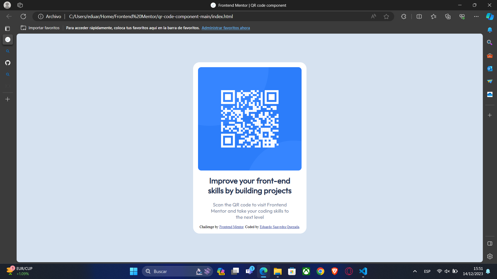
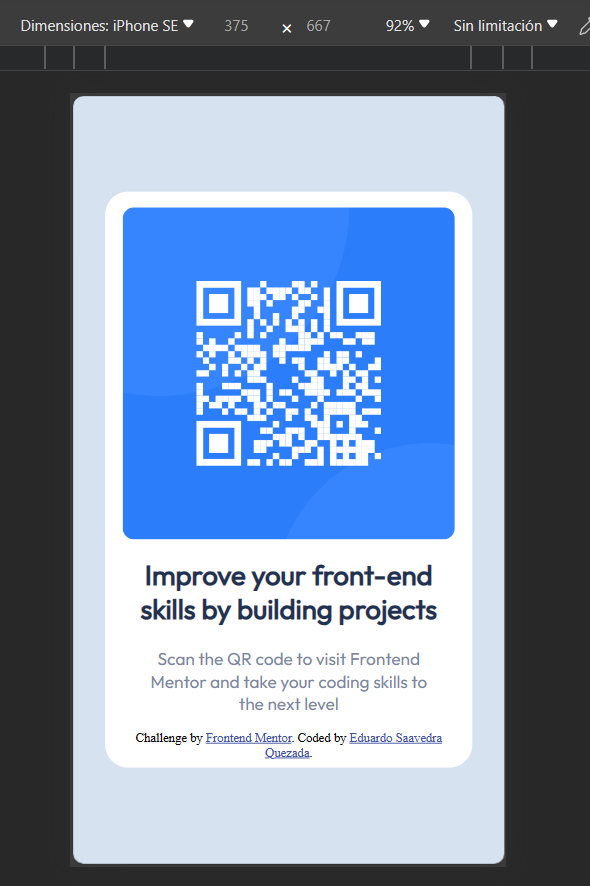

# Frontend Mentor - QR code component solution

This is a solution to the [QR code component challenge on Frontend Mentor](https://www.frontendmentor.io/challenges/qr-code-component-iux_sIO_H). Frontend Mentor challenges help you improve your coding skills by building realistic projects. 

## Table of contents

- [Overview](#overview)
  - [Screenshots](#screenshots)
    - [Desktop Screenshot](#desktop-screenshot)
    - [Mobile Screenshot](#mobile-screeenshot)
  - [Link](#link)
- [My process](#my-process)
  - [Built with](#built-with)
  - [What I learned](#what-i-learned)
  - [Continued development](#continued-development)
  - [Useful resources](#useful-resources)
- [Author](#author)

## Overview

### Screenshots

#### Desktop Screenshot


#### Mobile Screeenshot


### Link

- Live Site URL: [Solution Github Live Site](https://eduardosaavedraq.github.io/ESQ_qr-code-component-main/)

## My process

### Built with

- Semantic HTML5 markup
- CSS custom properties
- Flexbox
- Mobile-first workflow

### What I learned

This was my first challenge from Frontend Mentor; however, it wasn't my first approach to html and css.

I've worked with these two languages in some other college projects but I hadn't studied them carefuly becuase of the hurry to deliever the assignments and, despite what I stated above, this was the first time I applied the Mobile-first workflow and used css media queries.

```css
@media screen and (min-width: 376px) {
    .container {
        width: 350px;
        height: 530px;
        padding: 15px 15px;
    }

    img {
        margin-top: auto;
        width: 100%;
    }

    p {
        margin: 0 9%;
    }
}
```

### Continued development

I want to keep practicing Responsive designing. I'm a little obsesive and I don't feel completely sitisfied until my work looks great on every device. For example, the following are examples of devices where the QR looks very small because of the dimensions of the devices:


And look what happen if I change to a landscape view on an IPhone SE:


### Useful resources

- [w3schools HTML tutorial](https://www.w3schools.com/html/default.asp)
- [w3schools CSS tutorial](https://www.w3schools.com/css/default.asp)

The two resources above helped me to begin on this.

- [How to Order CSS Properties](https://www.example.com) - I looked for this because I wanted to know if there was some kind of standar to follow.

## Author

- GitHub - [@EduardoSaavedraQ](https://github.com/EduardoSaavedraQ)
- Frontend Mentor - [@EduardoSaavedraQ](https://www.frontendmentor.io/profile/EduardoSaavedraQ)